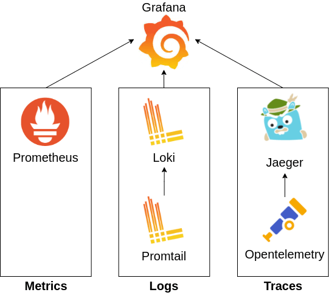
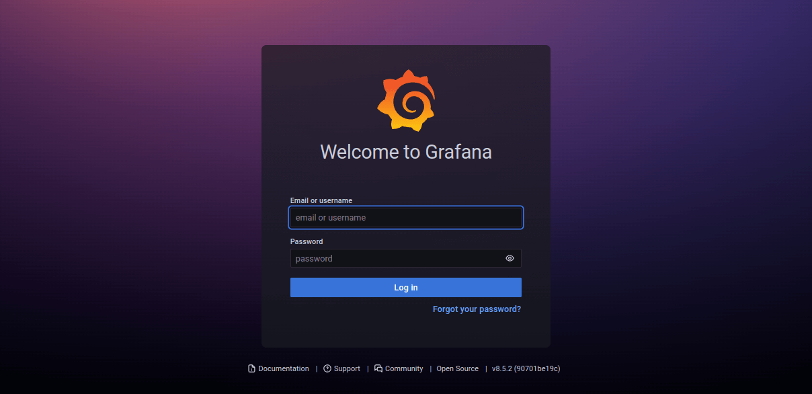
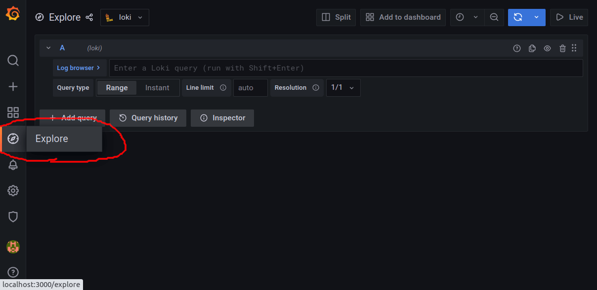
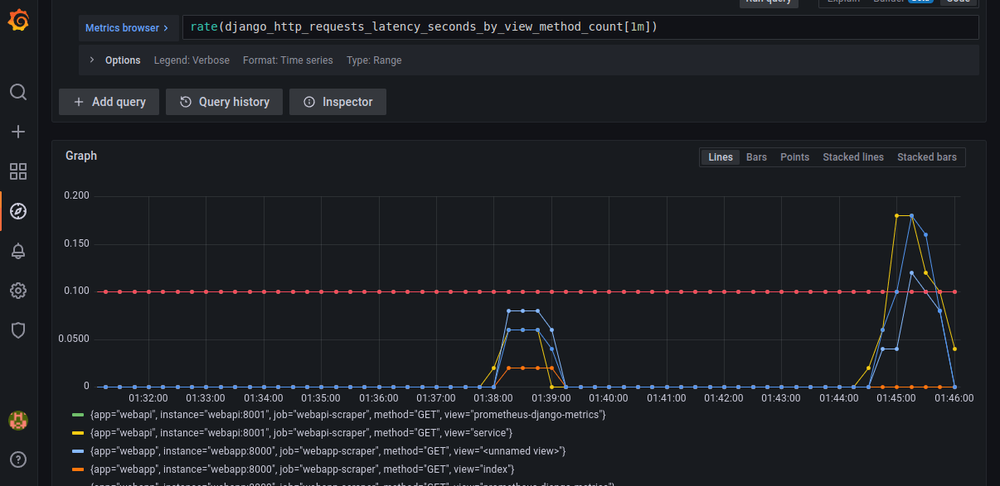
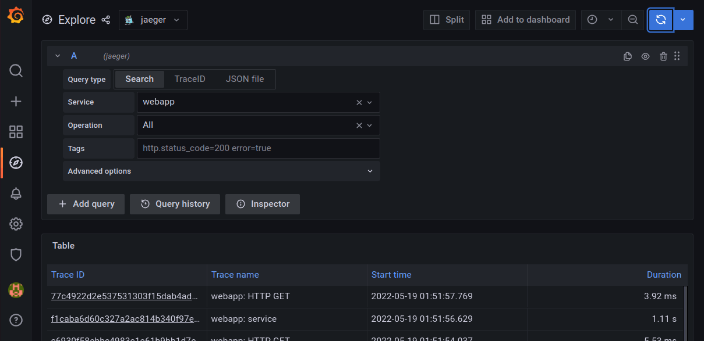

# MLT with Django

This project is a demonstration of how observability can be implemented in microservices/distributed systems that are built with python/Django. For monitoring, the MLT observability triad is collected:

* Metrics
* Logs
* Traces

To see the complete article/tutorial, go to [rafed.github.io/devra/posts/cloud/django-mlt-observability-with-opentelemetry/](https://rafed.github.io/devra/posts/cloud/django-mlt-observability-with-opentelemetry/).

Open source technologies listed below are used to collect MLT data:

1. **Grafana** _[Dashboard]_: This is a dashboard where we will observe the MLT data collected by the rest of the services.
2. **Prometheus** _[Monitoring]_: Collects and stores metrics from applications.
3. **Promtail** _[Logging]_: Collects log data from applications and sends them to Loki. 
4. **Loki** _[Logging]_: Aggregates and stores all logs sent by Promtail.
5. **Opentelemetry** _[Tracing]_: Instruments an app to collect traces and sends them to Jaeger.
6. **Jaeger** _[Tracing]_: Collects and stores tracing information. Also helps in trace visualization.
7. **Elasticsearch** _[Tracing]_: As storage backend for Jaeger.

The following figure summarizes the technology dependencies.



## Changes from upstream

1. Separate compose files for apps and observability containers. App containers must use the `observability` network to be able to reach the observability containers.
2. Docker discovery. **Prometheus** and **Promtail** discover targets using Docker and keep targets depending on container labels. Check [`apps-compose.yaml`](apps-compose.yaml) for an example.
3. Separate containers for the Jaeger components.
4. Data persistence. All data is persisted via Docker volumes.
5. Uses the latest versions, except for Elasticsearch as Jaeger does not support version 8.x.

## Testing the example

To run the project, follow the steps below.

```bash
$ git clone https://github.com/jesusfer/mlt_django
$ cd mlt_django
$ docker-compose up
```

Make some requests on the webapp [localhost:8000/service](http://localhost:8000/service) to generate MLT data. Then, go to [localhost:3000](http://localhost:3000]) to view the grafana dashboard. Login using username:admin and password:admin.



Go to **explore** and you should be able to see MLT data collected from the apps. Check demo below.

### Grafana dashboard



### Logs from Loki


### Metrics from Prometheus



### Traces from Jaeger




To see the complete article/tutorial, go to [rafed.github.io/devra/posts/cloud/django-mlt-observability-with-opentelemetry/](https://rafed.github.io/devra/posts/cloud/django-mlt-observability-with-opentelemetry/).